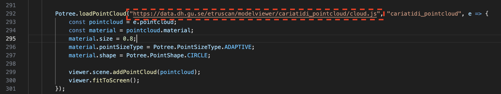

# About

* Potree is a free open-source WebGL based point cloud renderer for large point clouds. It is based on the [TU Wien Scanopy project](https://www.cg.tuwien.ac.at/research/projects/Scanopy/) and research projects [Harvest4D](https://harvest4d.org/), [GCD Doctoral College](https://gcd.tuwien.ac.at/) and [Superhumans](https://www.cg.tuwien.ac.at/research/projects/Superhumans/).
* Newest information and work in progress is usually available on [twitter](https://twitter.com/m_schuetz)
* Contact: Markus Schütz (mschuetz@potree.org)
* References: 
    * [Potree: Rendering Large Point Clouds in Web Browsers](https://www.cg.tuwien.ac.at/research/publications/2016/SCHUETZ-2016-POT/SCHUETZ-2016-POT-thesis.pdf) (2016)
    * [Fast Out-of-Core Octree Generation for Massive Point Clouds](https://www.cg.tuwien.ac.at/research/publications/2020/SCHUETZ-2020-MPC/) (2020)
    
<a href="http://potree.org/wp/demo/" target="_blank">  </a>

# Getting Started

### Install on your PC

Install [node.js](http://nodejs.org/)

Install dependencies, as specified in package.json, and create a build in ./build/potree.

```bash
npm install
```

### Run on your PC

Use the `npm start` command to 

* create ./build/potree 
* watch for changes to the source code and automatically create a new build on change
* start a web server at localhost:1234. 

Go to http://localhost:1234/ to test the example.

Edit this line in index.html to change the pointcloud.
